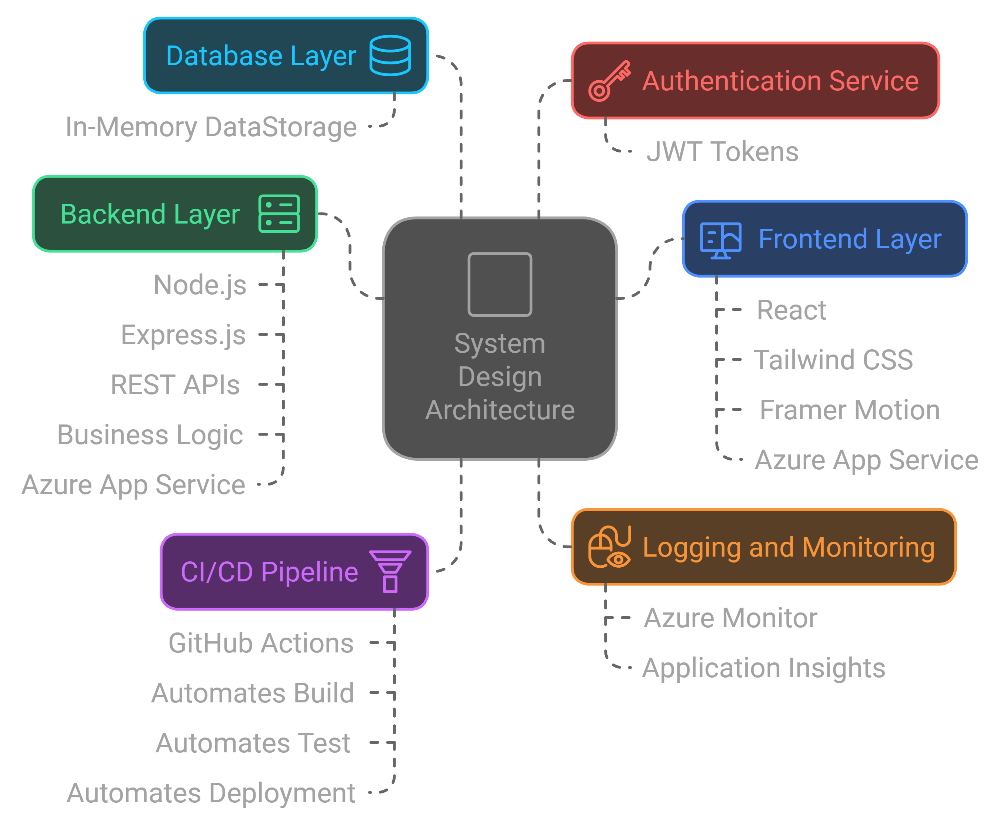
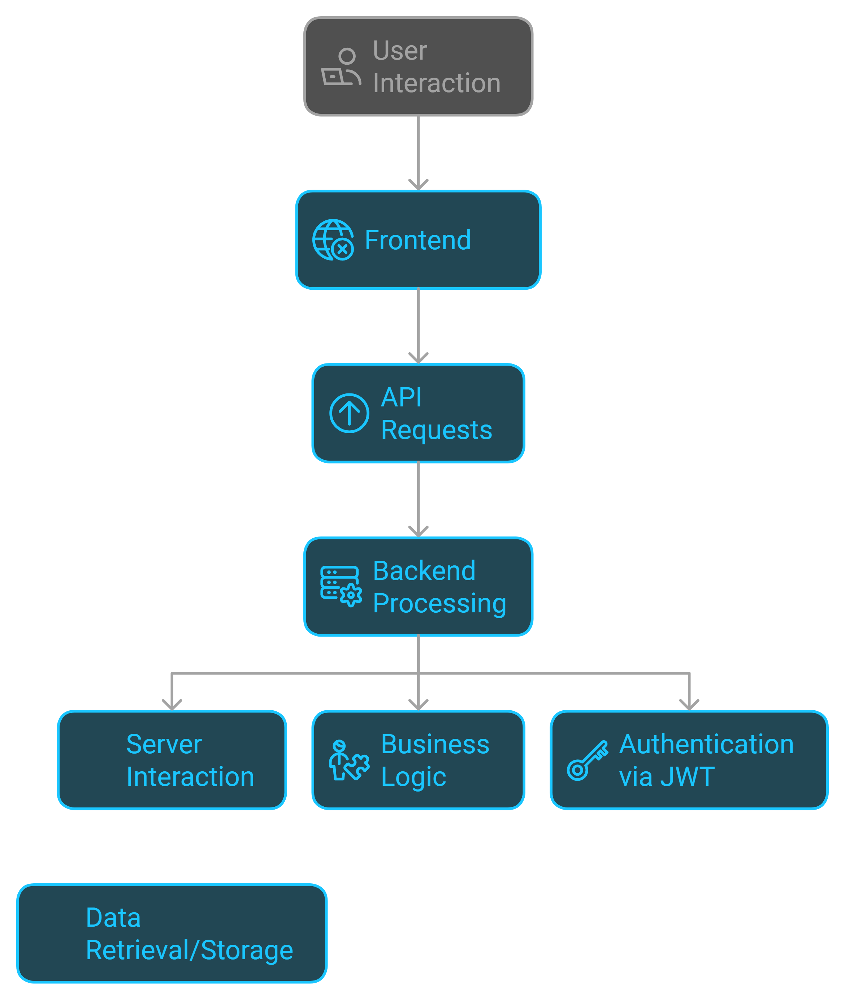

# Blog Platform

A modern full-stack blogging platform built with React and Node.js

## 🚀 Features

- User authentication and authorization
- Create, read, update, and delete blog posts
- Grammar checking
- Responsive design for all devices
- Rich text editor for post creation

## 🛠️ Tech Stack

### Frontend
- React
- TypeScript
- HTML5/CSS3
- Vite
- Framer Motion
- Tailwind CSS

### Backend
- Node.js
- Express.js

### Deployment
- Azure Web App

### CI/CD Pipeline
- GitHub Actions

### Future Updates will include AI Integration
- Google Gemini AI

## 📁 Project Structure

```
├── client/                # Frontend application
│   ├── src/               # React source code
│   ├── public/            # Static assets
│   ├── vite.config.js     # Vite configuration
│   └── package.json       # Frontend dependencies
├── server/                # Backend application
│   ├── src/               # Express API source code
│   ├── logs/              # Server logs
│   ├── index.js           # Entry point for the server
│   └── package.json       # Backend dependencies
├── .github/workflows/     # CI/CD workflow configuration
├── release.zip            # Deployment artifact
└── README.md              # Documentation
```

- **Frontend**: Handles the user interface and communicates with the backend via API calls.
- **Backend**: Hosts APIs, manages user authentication, and serves the static files for the React app.
- **Data-Storage**: In-Memory data-storage that stores user credentials, blog posts, and other application data.

## 🔄 Future Enhancements

- **AI Integration**: Adding Google Gemini AI for advanced grammar checking and content suggestions.
- **Containerization**: Dockerize the application for consistent environment management.

## ⚙️ Setup Instructions

### Prerequisites
- **Node.js** (v18 or later)
- **npm** (v7 or later)
- **Azure Account** (for deployment)

### Steps to Run Locally

1. **Clone the repository**:
   ```bash
   git clone https://github.com/Yogesh3052/Blog-Patform.git
   cd Blog-Platform
   ```

2. **Install dependencies**:
   - For the frontend:
     ```bash
     cd client
     npm install
     ```
   - For the backend:
     ```bash
     cd server
     npm install
     ```

3. **Run the development servers**:
   - In the `client` directory, start the frontend:
     ```bash
     npm run dev
     ```
   - In the `server` directory, start the backend:
     ```bash
     node index.js
     ```

4. **Access the application**:
   - Frontend: [http://localhost:5173](http://localhost:5173)
   - Backend: [http://localhost:8080](http://localhost:8080)

## 🌐 Deployment Process

### **1. Prepare the Deployment Artifact**
- Run the following commands:
  ```bash
  cd client
  npm run build
  ```
  This will generate the `dist` folder in the `client` directory, which will be used by the backend to serve the frontend.
  - In CI/CD pipeline we wiil move the `dist` folder in the `server` directory

### **2. Zip the Artifact**
- Create a deployment artifact by zipping the  `server` folders:
  ```bash
  zip -r release.zip server
  ```

### **3. Deploy to Azure**
- Log in to Azure:
  ```bash
  az login
  ```
- Deploy using Azure CLI or the Azure portal:
  - Set up an **App Service** and upload the `release.zip`.
  - Use the Startup Command: `node index.js`.

### **4. CI/CD Pipeline**
- The GitHub Actions workflow (`.github/workflows/main_pencraft.yml`) automates the build and deployment process:
  - On pushing changes to the `main` branch.
  - The workflow will automatically:
    - Install Dependencies in `client` folder
    - Build the frontend.
    - Install Dependencies in `server` folder
    - Move the `client/dist` to `server`
    - Bundle the `server` into an artifact.
    - Deploy the artifact to Azure.

## 🏗️ Architecture Overview
   


